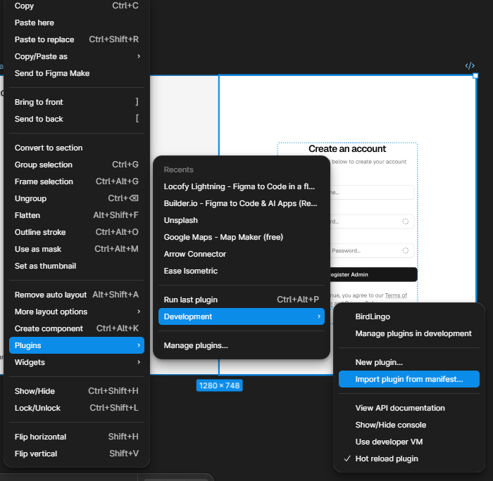

# 

<p align="center">
  <p align="center" color="orange">
         BirdLingo Labs: The Localization Suite
  </p>
  <strong align="center>Lingo.dev - Open-source i18n toolkit for LLM-powered localization</strong>
</p>

---

## 📁 Repository Structure

Based on the project architecture, the suite is organized as a modular monorepo:

### 🏗 Project Architecture

| Directory | Component | Description | Status |
| :--- | :--- | :--- | :--- |
| `BirdLingo/` | **Core Engine** | Instant on-canvas translation previews for Figma frames. | `STABLE` |
| `BridLingoBridge/` | **Bridge Utility** | Generates structured, multilingual JSON files from design layers. | `STABLE` |
| `BridLingoDetect/` | **QA Engine** | Automated detection for layout overflows and UI breaks. | `COMING SOON` |
| `backend/` | **Service Layer** | Scalable logic handling translation requests and data orchestration. | `STABLE` |
| `web/` | **Showcase Site** | The Vite-powered landing page and hackathon project hub. | `LIVE` |
---

## 🚀 The Suite

### 1. BirdLingo Translation
The flagship tool for designers. It allows for instant localization of Figma frames into multiple languages to test visual integrity.
* **Main Entry**: `code.js`
* **UI Layer**: `ui.html`

### 2. BirdLingo Bridge
The developer’s favorite. It bridges the gap by extracting Figma text nodes and mapping them to production-ready i18n keys.
* **Output**: Clean, nested JSON localization files.
* **Impact**: Eliminates manual copy-pasting and ensures naming consistency across the stack.

### 3. BirdLingo Detect (Roadmap)
A specialized engine built to detect where "text expansion" (common in languages like German or Finnish) breaks containers or overlaps elements.

---

## 🛠 Tech Stack

* **Plugin Engine**: Figma Manifest V3, TypeScript, and JavaScript.
* **Web Showcase**: HTML, Tailwind CSS, and Vite.
* **Environment**: Node.js managed via `package.json`.

---

## 📥 Installation & Development

### 1. Clone the Monorepo
```bash
git clone https://github.com/Techharik/BirdLingo
cd backend
---
```
Add Env:

```bash

env 
VITE_LINGODOTDEV_API_KEY=YOUR_SDK_ENV
```
Start the Serevr : 
```bash
node server.js
```

## Figma setup 

- Open Figme right click and go for plugins ans select the development.

- click on Import plugin from manifest 
- select the manifest file from /Bridlingo folder for bridlingo
-Select the manifest file form /BridLingoBridge folder for birdlingoBridge
-Plugin runs in the developement